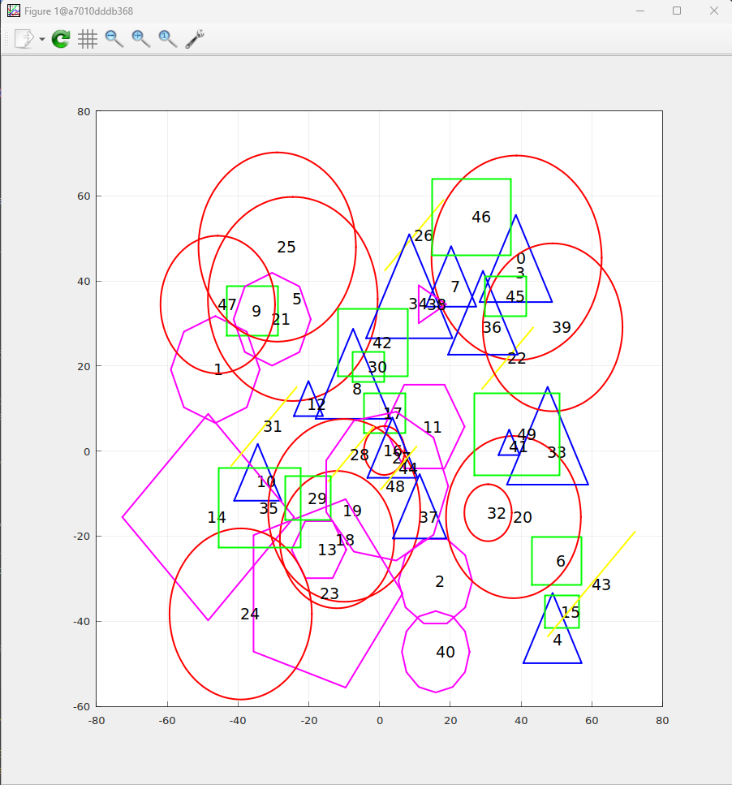
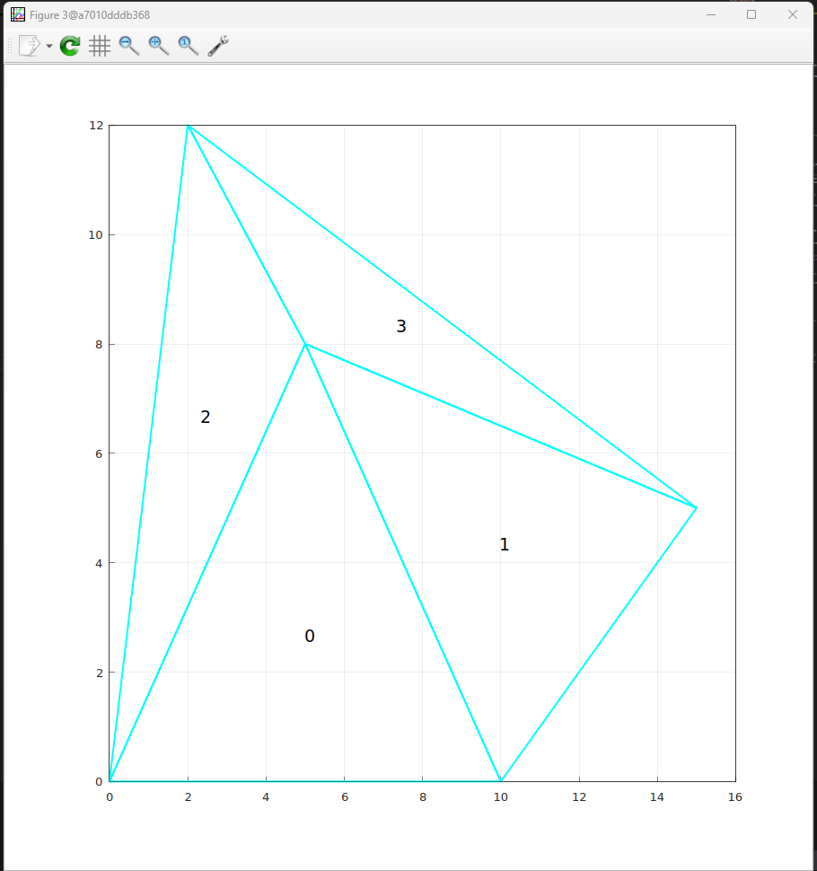

# Библиотека геометрических примитивов на C++23

Библиотека для работы с геометрическими примитивами. Проект разработан с активным применением современных возможностей C++, включая словарные типы, диапазоны и новые атрибуты.

<!-- omit in toc -->
- [Ключевые особенности](#ключевые-особенности)
  - [Геометрические примитивы](#геометрические-примитивы)
  - [Реализованные алгоритмы](#реализованные-алгоритмы)
  - [Использование современного C++](#использование-современного-c)
- [Технологический стек](#технологический-стек)
- [Сборка и запуск](#сборка-и-запуск)
  - [Сборка проекта](#сборка-проекта)
  - [Запуск приложения](#запуск-приложения)
  - [Запуск тестов](#команда-для-запуска-тестов)
  - [Отладка](#отладка)
- [Дополнительно](#дополнительно)

## Ключевые особенности

### Геометрические примитивы

- Реализован набор базовых фигур: `Point2D`, `Line`, `Triangle`, `Rectangle`, `RegularPolygon`, `Polygon`, `Circle`.
- Для полиморфной работы с фигурами используется `std::variant`, что позволяет избежать накладных расходов на виртуальные таблицы и обеспечивает типобезопасность.

### Реализованные алгоритмы

- **Выпуклая оболочка:** Реализован **алгоритм Грэхема** для нахождения минимальной выпуклой оболочки для набора точек (`O(N * log(N))`).
- **Триангуляция Делоне:** Реализован **алгоритм Боуэра-Ватсона** для разбиения набора точек на треугольники, удовлетворяющие условию Делоне.
- **Поиск пересечений:** С помощью двойной диспетчеризации (`std::visit`) реализован поиск точных пересечений для пар фигур: `Line-Line`, `Line-Circle`, `Circle-Circle`.
- **Поиск коллизий:** Реализован быстрый поиск возможных столкновений методом **Bounding Box** (AABB).
- **Анализ объектов:** Разработаны функции для вычисления расстояний (от точки до фигуры, между фигурами) и анализа свойств (поиск самой высокой фигуры).

### Использование современного C++

- **C++23:** Проект активно использует возможности последнего стандарта.
- **Ranges:** Для лаконичной и эффективной работы с коллекциями применяются алгоритмы из библиотеки диапазонов.
- **Словарные типы:** Используются `std::optional` и `std::expected` для безопасной обработки результатов, которые могут отсутствовать или содержать ошибку.
- **Атрибуты и спецификаторы:** Методы классов снабжены атрибутами `[[nodiscard]]` и спецификаторами `noexcept` для повышения безопасности и ясности кода.
- **Форматирование:** Реализован `std::formatter` для `std::vector<geometry::Point2D>` с поддержкой пользовательских спецификаторов (`{}` и `{:new_line}`).

## Технологический стек

- **Язык:** C++23
- **Система сборки:** CMake
- **Менеджеры зависимостей:** Conan, CPM.cmake
- **Тестирование:** GoogleTest
- **Визуализация:** matplotplusplus
- **Среда разработки:** VS Code Dev Docker container

## Сборка и запуск

Проект использует настроенное окружение в Docker и стандартные инструменты для упрощения процесса разработки.

### Сборка проекта

Нажмите `F5` в VS Code. Эта команда автоматически выполнит следующие шаги:
- Создаст директорию `build`.
- Вызовет `conan` для установки зависимостей.
- Запустит `cmake` для конфигурации и сборки проекта.
- Запустит приложение в отладчике `lldb`.

### Запуск приложения

```bash
cd build
./GeometryApp
```

### Команда для запуска тестов

```bash
cd build
ctest
```

### Команды для запуска отладчика

В `Visual Studio Code` настройки параметров для запуска отладчика находятся в `.vscode/launch.json` файле. Поскольку в этом файле уже есть одна конфигурация `Launch GeometryApp` для запуска приложения, которое вычисляет контрольную сумму файла, то для запуска отладчика достаточно нажать `F5` или открыть окно `Run and Debug` комбинацией клавиш `Ctrl+Shift+D`.

## Примеры использования

Библиотека интегрирована с `matplotplusplus` для визуализации геометрических объектов и результатов работы алгоритмов. `matplotplusplus` может использовать `gnuplot` в качестве бэкенда.

### Пересечение фигур (Shape Intersections)

Пример построения набора случайных фигур.



### Выпуклая оболочка (Convex Hull)

Пример нахождения выпуклой оболочки для набора случайных точек.


### Триангуляция Делоне (Delaunay Triangulation)

Пример построения триангуляции Делоне.




## Дополнительно

- Автодополнение `Ctrl + Space`. Для настройки автодополнения вам необходимо нажать `F1` и выполнить команду `clangd: Download language server`. VS Code сам предложит установить подходящую версию `clangd` (всплывашка в правом нижнем углу). После завершения установки потребуется перезагрузить окно (кнопка перезапуска будет находиться также справа снизу или нажать `F1` и выполнить команду `Developer: Reload Window`)

Если всё сделано правильно - после успешной сборки проекта вы сможете использовать автодополнение
